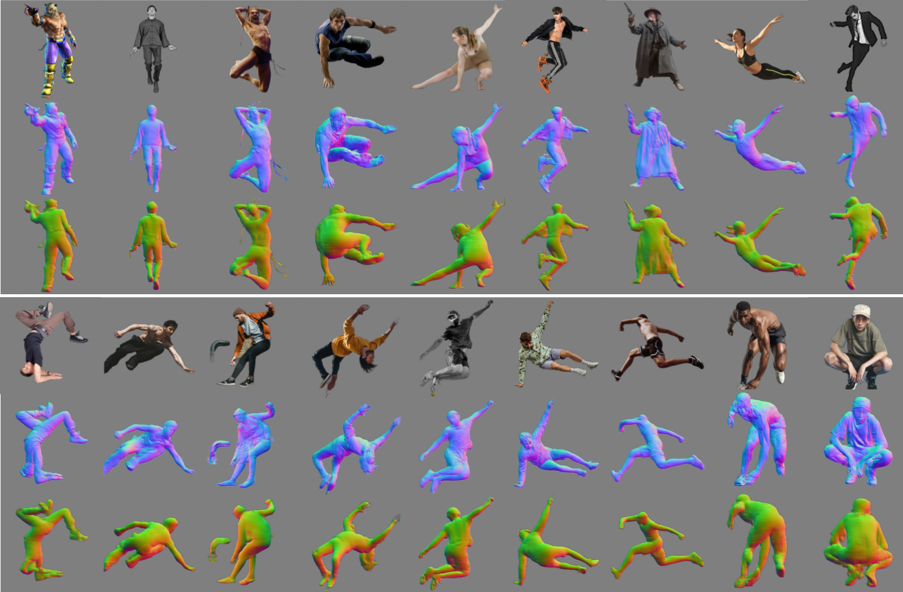

<!-- PROJECT LOGO -->

<p align="center">

  <h1 align="center">ICON: Implicit Clothed humans Obtained from Normals</h1>
  <p align="center">
    <a href="https://ps.is.tuebingen.mpg.de/person/yxiu"><strong>Yuliang Xiu</strong></a>
    ·
    <a href="https://ps.is.tuebingen.mpg.de/person/jyang"><strong>Jinlong Yang</strong></a>
    ·
    <a href="https://ps.is.mpg.de/~dtzionas"><strong>Dimitrios Tzionas</strong></a>
    ·
    <a href="https://ps.is.tuebingen.mpg.de/person/black"><strong>Michael J. Black</strong></a>
  </p>
  <h2 align="center">CVPR 2022</h2>
  <div align="center">
    
  </div>

  <p align="center">
  <br>
    <a href="https://pytorch.org/get-started/locally/"></a>
    <a href="https://pytorchlightning.ai/"></a>
    <a href='https://colab.research.google.com/drive/1-AWeWhPvCTBX0KfMtgtMk10uPU05ihoA?usp=sharing' style='padding-left: 0.5rem;'></a>
    <a href="https://huggingface.co/spaces/Yuliang/ICON"  style='padding-left: 0.5rem;'></a><br></br>
    <a href='https://arxiv.org/abs/2112.09127'>
      
    </a>
    <a href='https://icon.is.tue.mpg.de/' style='padding-left: 0.5rem;'>
      
    <a href="https://discord.gg/Vqa7KBGRyk"></a>
    <a href="https://youtu.be/hZd6AYin2DE"></a>
  </p>
</p>

<br />
<br />

## News :triangular_flag_on_post:
- [2022/07/30] <a href="https://huggingface.co/spaces/Yuliang/ICON"  style='padding-left: 0.5rem;'></a> <a href='https://colab.research.google.com/drive/1-AWeWhPvCTBX0KfMtgtMk10uPU05ihoA?usp=sharing' style='padding-left: 0.5rem;'></a> are both available.
- [2022/07/26] New cloth-refinement module is released, try `-loop_cloth`.
- [2022/06/13] ETH Zürich students from 3DV course create an add-on for [garment-extraction](docs/garment-extraction.md).  
- [2022/05/16] <a href="https://github.com/Arthur151/ROMP">BEV</a> is supported as optional HPS by <a href="https://scholar.google.com/citations?hl=en&user=fkGxgrsAAAAJ">Yu Sun</a>, see [commit #060e265](https://github.com/YuliangXiu/ICON/commit/060e265bd253c6a34e65c9d0a5288c6d7ffaf68e).
- [2022/05/15] Training code is released, please check [Training Instruction](docs/training.md).
- [2022/04/26] <a href="https://github.com/Jeff-sjtu/HybrIK">HybrIK (SMPL)</a> is supported as optional HPS by <a href="https://jeffli.site/">Jiefeng Li</a>, see [commit #3663704](https://github.com/YuliangXiu/ICON/commit/36637046dcbb5667cdfbee3b9c91b934d4c5dd05).
- [2022/03/05] <a href="https://github.com/YadiraF/PIXIE">PIXIE (SMPL-X)</a>, <a href="https://github.com/mkocabas/PARE">PARE (SMPL)</a>, <a href="https://github.com/HongwenZhang/PyMAF">PyMAF (SMPL)</a> are all supported as optional HPS.

<br>

<!-- TABLE OF CONTENTS -->
<details open="open" style='padding: 10px; border-radius:5px 30px 30px 5px; border-style: solid; border-width: 1px;'>
  <summary>Table of Contents</summary>
  <ol>
    <li>
      <a href="#who-needs-ICON">Who needs ICON</a>
    </li>
    <li>
      <a href="#instructions">Instructions</a>
    </li>
    <li>
      <a href="#running-demo">Running Demo</a>
    </li>
    <li>
      <a href="#citation">Citation</a>
    </li>
    <li>
      <a href="#acknowledgments">Acknowledgments</a>
    </li>
    <li>
      <a href="#license">License</a>
    </li>
    <li>
      <a href="#disclosure">Disclosure</a>
    </li>
    <li>
      <a href="#contact">Contact</a>
    </li>
  </ol>
</details>
<br />
<br />

## Who needs ICON?

- If you want to **Train & Evaluate** on **PIFu / PaMIR / ICON** using your own data, please check [dataset.md](./docs/dataset.md) to prepare dataset, [training.md](./docs/training.md) for training, and [evaluation.md](./docs/evaluation.md) for benchmark evaluation.


- Given a raw RGB image, you could get:
  - image (png): 
    - segmented human RGB
    - normal maps of body and cloth
    - pixel-aligned normal-RGB overlap
  - mesh (obj):
    - SMPL-(X) body from *PyMAF, PIXIE, PARE, HybrIK, BEV*
    - 3D clothed human reconstruction
    - 3D garments (requires 2D mask)
  - video (mp4): 
    - self-rotated clothed human

|                    |
| :------------------------------------------------------------------------: |
|                       _ICON's intermediate results_                        |
|                              |
|                       _ICON's SMPL Pose Refinement_                        |
|                   __                   |
|      _Image -- overlapped normal prediction -- ICON -- refined ICON_       |
|                                           |
|              _3D Garment extracted from ICON using 2D mask_                |


<br>

## Instructions

- See [docs/installation.md](docs/installation.md) to install all the required packages and setup the models
- See [docs/dataset.md](docs/dataset.md) to synthesize the train/val/test dataset from THuman2.0
- See [docs/training.md](docs/training.md) to train your own model using THuman2.0
- See [docs/evaluation.md](docs/evaluation.md) to benchmark trained models on THuman2.0
- Add-on: [Garment Extraction from Fashion Images](docs/garment-extraction.md), supported by ETH Zürich students as 3DV course project.

<br>

## Running Demo

```bash
cd ICON

# model_type: 
#   "pifu"            reimplemented PIFu
#   "pamir"           reimplemented PaMIR
#   "icon-filter"     ICON w/ global encoder (continous local wrinkles)
#   "icon-nofilter"   ICON w/o global encoder (correct global pose)

python -m apps.infer -cfg ./configs/icon-filter.yaml -gpu 0 -in_dir ./examples -out_dir ./results -export_video -loop_smpl 100 -loop_cloth 200 -hps_type pymaf

```

## More Qualitative Results

|                             |
| :----------------------------------------------------------: |
|       _Comparison with other state-of-the-art methods_       |
|                            |
| _Predicted normals on in-the-wild images with extreme poses_ |

<br/>
<br/>

## Citation

```bibtex
@inproceedings{xiu2022icon,
  title     = {{ICON}: {I}mplicit {C}lothed humans {O}btained from {N}ormals},
  author    = {Xiu, Yuliang and Yang, Jinlong and Tzionas, Dimitrios and Black, Michael J.},
  booktitle = {Proceedings of the IEEE/CVF Conference on Computer Vision and Pattern Recognition (CVPR)},
  month     = {June},
  year      = {2022},
  pages     = {13296-13306}
}
```

## Acknowledgments

We thank [Yao Feng](https://ps.is.mpg.de/person/yfeng), [Soubhik Sanyal](https://ps.is.mpg.de/person/ssanyal), [Qianli Ma](https://ps.is.mpg.de/person/qma), [Xu Chen](https://ait.ethz.ch/people/xu/), [Hongwei Yi](https://ps.is.mpg.de/person/hyi), [Chun-Hao Paul Huang](https://ps.is.mpg.de/person/chuang2), and [Weiyang Liu](https://wyliu.com/) for their feedback and discussions, [Tsvetelina Alexiadis](https://ps.is.mpg.de/person/talexiadis) for her help with the AMT perceptual study, [Taylor McConnell](https://ps.is.mpg.de/person/tmcconnell) for her voice over, [Benjamin Pellkofer](https://is.mpg.de/person/bpellkofer) for webpage, and [Yuanlu Xu](https://web.cs.ucla.edu/~yuanluxu/)'s help in comparing with ARCH and ARCH++.

Special thanks to [Vassilis Choutas](https://ps.is.mpg.de/person/vchoutas) for sharing the code of [bvh-distance-queries](https://github.com/YuliangXiu/bvh-distance-queries)

Here are some great resources we benefit from:

- [MonoPortDataset](https://github.com/Project-Splinter/MonoPortDataset) for Data Processing
- [PaMIR](https://github.com/ZhengZerong/PaMIR), [PIFu](https://github.com/shunsukesaito/PIFu), [PIFuHD](https://github.com/facebookresearch/pifuhd), and [MonoPort](https://github.com/Project-Splinter/MonoPort) for Benchmark
- [SCANimate](https://github.com/shunsukesaito/SCANimate) and [AIST++](https://github.com/google/aistplusplus_api) for Animation
- [rembg](https://github.com/danielgatis/rembg) for Human Segmentation
- [PyTorch-NICP](https://github.com/wuhaozhe/pytorch-nicp) for normal-based non-rigid refinement
- [smplx](https://github.com/vchoutas/smplx), [PARE](https://github.com/mkocabas/PARE), [PyMAF](https://github.com/HongwenZhang/PyMAF), [PIXIE](https://github.com/YadiraF/PIXIE), [BEV](https://github.com/Arthur151/ROMP), and [HybrIK](https://github.com/Jeff-sjtu/HybrIK) for Human Pose & Shape Estimation
- [CAPE](https://github.com/qianlim/CAPE) and [THuman](https://github.com/ZhengZerong/DeepHuman/tree/master/THUmanDataset) for Dataset
- [PyTorch3D](https://github.com/facebookresearch/pytorch3d) for Differential Rendering

Some images used in the qualitative examples come from [pinterest.com](https://www.pinterest.com/).

This project has received funding from the European Union’s Horizon 2020 research and innovation programme under the Marie Skłodowska-Curie grant agreement No.860768 ([CLIPE Project](https://www.clipe-itn.eu)).

<br>

--------------

<br>

## License

This code and model are available for non-commercial scientific research purposes as defined in the [LICENSE](LICENSE) file. By downloading and using the code and model you agree to the terms in the [LICENSE](LICENSE).

## Disclosure

MJB has received research gift funds from Adobe, Intel, Nvidia, Meta/Facebook, and Amazon. MJB has financial interests in Amazon, Datagen Technologies, and Meshcapade GmbH. While MJB was a part-time employee of Amazon during this project, his research was performed solely at, and funded solely by, the Max Planck Society.

## Contact

For more questions, please contact icon@tue.mpg.de

For commercial licensing, please contact ps-licensing@tue.mpg.de
